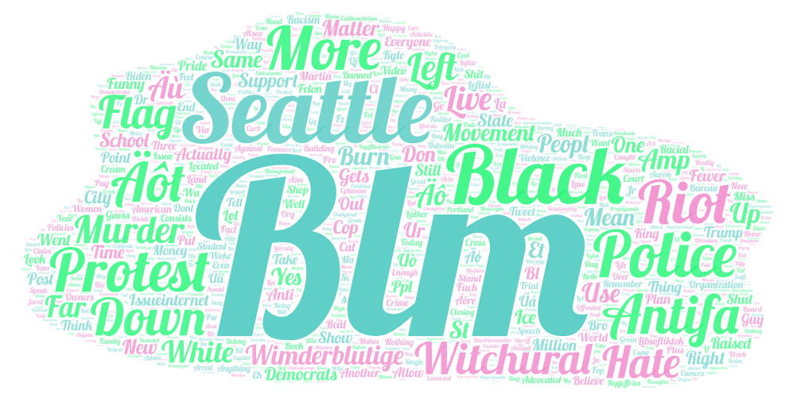

# Sadiiq206.github.io

## Sadiiq Mohamed: Lab 2

[wordcloud-1](/assets/twsearch-result-1.csv)
.png)
[wordcloud-4(north)](/assets/twsearch-result-4(north).csv)
.png)
[wordcloud-3(east)](/assets/twsearch-result-3(east).csv)
.png)
[wordcloud-2(south)](/assets/twsearch-result-2(south).csv)
.png)
[wordcloud-5(west)](/assets/twsearch-result-5(west).csv)

> This is the images included in the code.
> Below the images is the link to download the CSV data.

## Coordinates

Coordinates:
UW Seattle
47.65548684228424, -122.30347698647448

wordcloud-1
example from lab2.

wordcloud-4(north)
Distance to Lynwood:
14.96mi

wordcloud-3(east)
Distance to Redmond:
10.66mi

wordcloud-2(south)
Distance to Federal Way:
23.69mi

wordcloud-5(west)
Distance to Bremertan:
13.90mi

# Summary
The topic of my research is the usage of the keyword "BLM" on Twitter, with a focus on the geographical differences in the usage of the keyword around the University of Washington Seattle campus. The parameters used for my research included running the keyword "BLM" through the Twitter API and using a word cloud to generate a visualization of the most common words associated with the keyword in the North, East, South, and West areas of the UW Seattle campus. The date since June 9th, 2020, the day of the Capital Hill protest.

I wanted to make this comparison because I was interested in understanding how the usage of the keyword "BLM" varies across different regions around the UW Seattle campus. I wanted to see if there were any patterns or differences in the way the keyword was used in different areas around the university, and if so, what might be the reasons for these patterns.

Comparing the word clouds, it appears that there is a similarity in the usage of the keyword "BLM" across all regions of Seattle. The most common words associated with the keyword in all regions include "protest," "police," "antifa," and "riot." However, there are also some differences in the usage of the keyword across different regions. For example, in the North region, the word "support" is more common, whereas in the South region, the word "flag" is more common.

There may be a number of possible reasons for the patterns observed in the usage of the keyword "BLM" across different regions of Seattle. For example, the North region may have a stronger presence of social justice activists, leading to a higher usage of the word "support." Similarly, the South region may have a stronger sense of community, leading to a higher usage of the word "flag." Additionally, the location of the police departments may play a role in the usage of the word "police" in many regions.

In the future, my research could be improved by including a larger sample size of tweets, as well as incorporating other forms of social media to get a more comprehensive understanding of the usage of the keyword "BLM" around the UW Seattle campus. Additionally, it could be useful to include data on the demographics of the users tweeting the keyword, such as age, gender, and race, to better understand the patterns observed.

From the map, I found that the overall usage of the keyword "BLM" is similar across all regions of Seattle, which was not what I had expected before the exercise. I had assumed that there would be a more significant difference in usage across different regions, but the data suggests otherwise. This suggests that there may be a strong sense of unity in Seattle regarding issues of racial justice and the Black Lives Matter movement.